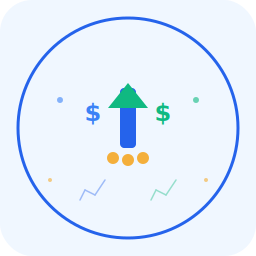

# Brand Guidelines - StockUp

## Logo & Visual Identity

### Logo Overview
The StockUp logo features:
- **Primary Shape**: Upward arrow representing growth and savings
- **Core Elements**: Dynamic arrow with dollar signs and coins symbolizing price comparison and financial growth
- **Style**: Modern, clean, minimalist
- **Versatility**: Works at any size, from favicon (16px) to billboard (4K+)
- **Tagline**: "Stock Up on Savings!"

### Logo Files
- `logo.svg` - Symbol/icon version (scalable, recommended for app icon)
- `logo-stockup.svg` - Horizontal logo with text (for headers/branding)
- `logo-icon.svg` - Square app icon version (for favicons and app launchers)
- `logo-256.png` - 256x256 pixel version
- `logo-128.png` - 128x128 pixel version (favicons)
- `logo-64.png` - 64x64 pixel version
- `logo-32.png` - 32x32 pixel version

### Color Palette

#### Primary Colors
| Color | Hex | RGB | Usage |
|-------|-----|-----|-------|
| Primary Blue | #2563eb | 37, 99, 235 | Main accent, primary actions |
| Success Green | #10b981 | 16, 185, 129 | Deals, savings, positive indicators |
| Warm Gold | #f59e0b | 245, 158, 11 | Highlights, special offers |
| Light Blue | #3b82f6 | 59, 130, 246 | Secondary elements |

#### Secondary Colors
| Color | Hex | RGB | Usage |
|-------|-----|-----|-------|
| Background | #f0f7ff | 240, 247, 255 | Light backgrounds |
| Text Dark | #1f2937 | 31, 41, 55 | Primary text |
| Text Gray | #6b7280 | 107, 114, 128 | Secondary text |
| Border Gray | #e5e7eb | 229, 231, 235 | Borders, dividers |

### Typography

#### Font Families
- **Display**: Inter, Segoe UI, -apple-system
- **Body**: Inter, Segoe UI, -apple-system
- **Monospace**: JetBrains Mono, Consolas (for code)

#### Font Sizes
- **H1 (Main Title)**: 32px, bold
- **H2 (Sections)**: 24px, semibold
- **H3 (Subsections)**: 18px, semibold
- **Body Text**: 14-16px, regular
- **Caption**: 12px, regular
- **Code**: 13px, monospace

### Logo Usage

#### ✅ Do's
- Use the full logo on light backgrounds
- Maintain minimum clear space (20% of logo width) around the logo
- Scale proportionally in both directions
- Use SVG format for web applications
- Apply logo to center or left-aligned positions
- Use the appropriate variant for background color

#### ❌ Don'ts
- Don't distort or skew the logo
- Don't change the colors arbitrarily
- Don't rotate the logo (except 90° increments if necessary)
- Don't add effects like shadows or glows
- Don't place logo on busy backgrounds without proper contrast
- Don't use the logo smaller than 32px on web

### Clear Space
Maintain a minimum clear space around the logo equal to 20% of the logo's width. This ensures the logo remains distinct and readable.

```
┌─────────────────────────────────┐
│  ░░░░░░░░  LOGO  ░░░░░░░░      │ 20% minimum clear space
│  ░░░░░░░░         ░░░░░░░░      │
│  ░░░░░░░░ (256px) ░░░░░░░░      │
│  ░░░░░░░░         ░░░░░░░░      │
│  ░░░░░░░░  ─────  ░░░░░░░░      │
└─────────────────────────────────┘
```

### Background Variations

#### Light Background
Use primary colors with full opacity:
- Best for: Websites, apps, light mode
- Colors: #2563eb, #10b981, #f59e0b

#### Dark Background
Use lighter/adjusted colors:
- Best for: Dark mode, printed materials on dark surfaces
- Create white/light variant for better contrast

#### Colored Background
Ensure sufficient contrast ratio (minimum 4.5:1 for text):
- Use white or very light colors for dark backgrounds
- Use dark colors for light backgrounds

## Application Styling

### Button Styles
```css
/* Primary Button */
background-color: #2563eb;
color: white;
padding: 10px 20px;
border-radius: 6px;

/* Secondary Button */
background-color: #10b981;
color: white;

/* Tertiary Button */
background-color: #f59e0b;
color: white;
```

### Cards & Containers
- Border radius: 8px (normal), 12px (large)
- Shadow: 0 1px 3px rgba(0,0,0,0.1)
- Padding: 16px-24px
- Background: White or #f0f7ff

### Icons
- Line weight: 2-2.5px
- Size: 16px, 24px, 32px, 48px
- Color: Inherit from text or use primary colors
- Rounded caps for better visual appeal

## Brand Voice & Tone

### Core Values
- **Smart**: Intelligent price comparison
- **Trustworthy**: Accurate, reliable information
- **Helpful**: Empowering shoppers
- **Simple**: Easy to use and understand
- **Fast**: Quick results

### Communication Style
- **Tone**: Friendly, professional, approachable
- **Language**: Clear, jargon-free
- **Personality**: Helpful assistant, not corporate
- **Messaging**: Benefits-focused, action-oriented

### Example Phrases
- "Find your best deal in seconds"
- "Smart shopping starts here"
- "Compare prices, save money"
- "Your personal price detective"
- "Shop smarter, save more"

## Logo Mockups

### Web Application
Place logo in:
- Top left corner (navbar/header)
- Center of login/splash screen
- Favicon in browser tab

### Desktop Application
- Title bar icon (32x32)
- About dialog (128x128)
- System tray (16x16)

### Printed Materials
- Business cards (1" x 0.5")
- Letterhead (1" tall)
- Brochures (2-3" tall)
- Posters (4-12" tall)

## File Formats & Specifications

| Format | Size | Use Case | Color Space |
|--------|------|----------|-------------|
| SVG | Scalable | Web, responsive | RGB |
| PNG | Multiple | Web, fallback | RGBA |
| JPEG | Multiple | Print, backgrounds | RGB |
| ICO | 16/32/64 | Website favicon | RGB |
| WEBP | Multiple | Modern web | RGBA |

## Accessibility

### Contrast Ratios
- All text and icons meet WCAG AA standard (4.5:1)
- Primary blue #2563eb on white: 7.2:1
- Success green #10b981 on white: 4.5:1
- Warm gold #f59e0b on white: 5.1:1

### Color Blindness Considerations
- Don't rely solely on color to convey information
- Use patterns or icons alongside colors
- Test designs with color blindness simulators

## Asset Directory Structure
```
branding/
├── logo.svg                    # Main vector logo
├── logo-white.svg              # White variant
├── favicon.ico                 # Browser tab icon
├── logo-256.png                # High res
├── logo-128.png                # Medium res
├── logo-64.png                 # Small res
├── logo-32.png                 # Tiny res
├── screenshots/                # App screenshots
├── mockups/                    # Logo mockups
└── color-palette.aco           # Adobe color swatch
```

## Usage Examples

### Website Header
```html

```

### Application Icon
```html
<link rel="icon" type="image/svg+xml" href="favicon.svg">
```

### Print
- Use high-resolution PNG or PDF export
- Minimum size: 1 inch (96 DPI)
- Maximum size: As large as needed

---

**Version**: 1.0
**Last Updated**: November 21, 2025
**Contact**: For brand usage inquiries, contact the maintainer
